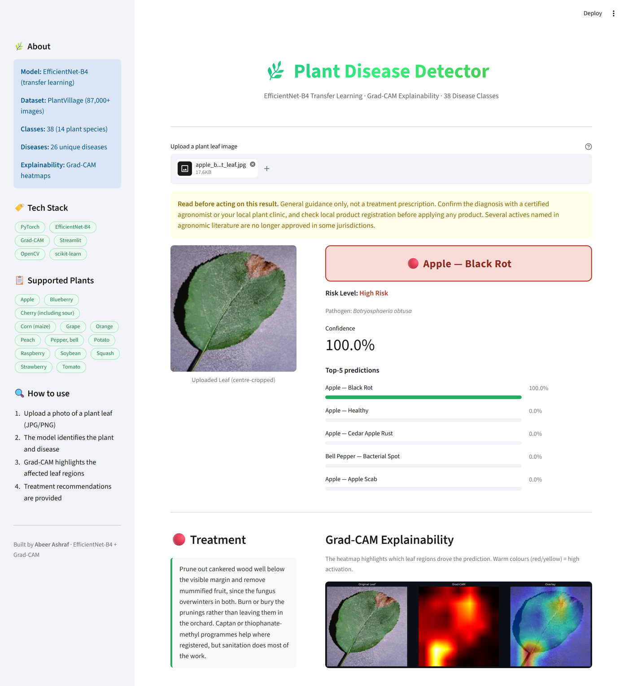
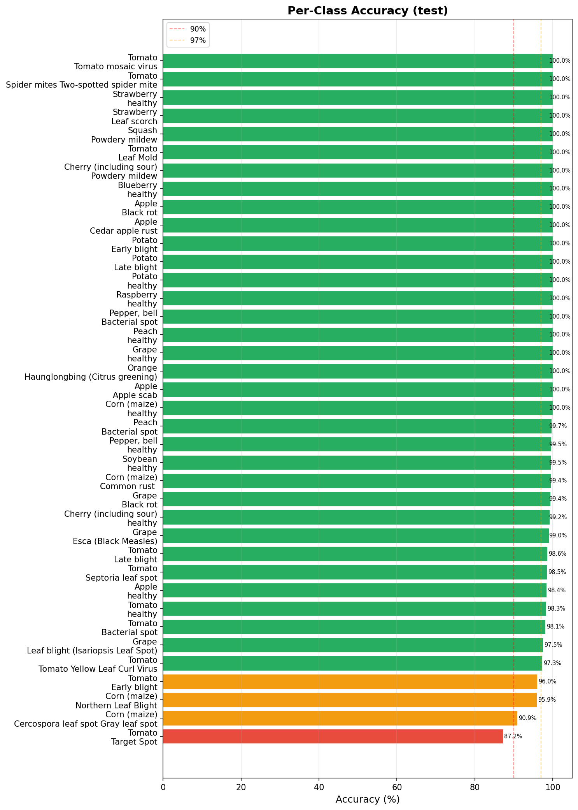
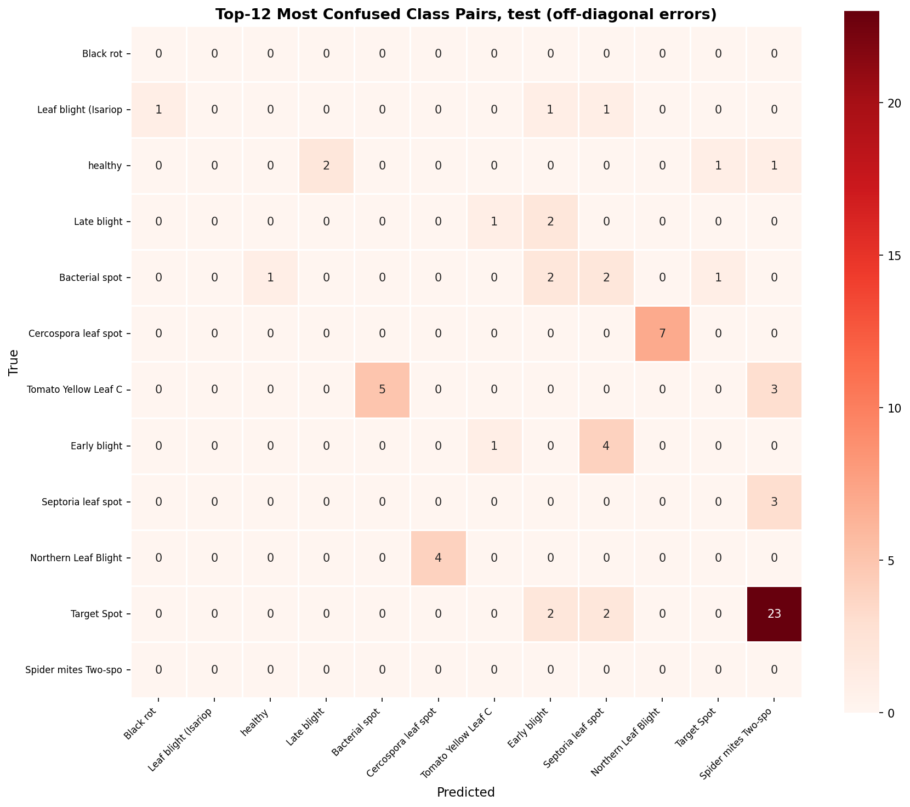
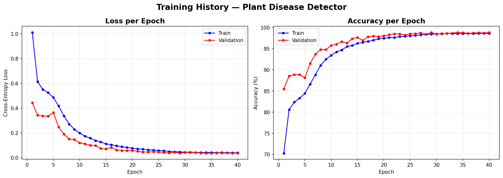
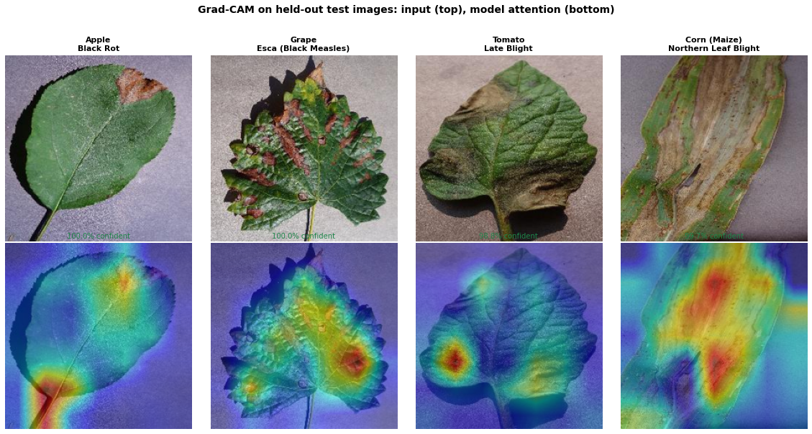

# Plant Disease Detector

> EfficientNet-B4 transfer learning for plant disease diagnosis across 38 classes: **98.68% on a held-out test split** built to be free of the near-duplicate leakage this dataset ships with, plus Grad-CAM explainability


**[Try the live demo](https://khawaja-plant-disease-detector.streamlit.app/)** - upload a leaf photo and get a diagnosis, a confidence breakdown, and a Grad-CAM heatmap showing what the model looked at.

> The demo runs on Streamlit Community Cloud's free tier, which puts an app to sleep after a period of inactivity. If you land on a "this app has gone to sleep" page, click the wake button and give it a minute.



---

## Overview

Multi-class classification of plant leaf images across **38 disease categories** (14 plant species, 26 diseases plus healthy variants) using a fine-tuned EfficientNet-B4 backbone with:

- **Two-phase transfer learning** - frozen backbone warm-up followed by full fine-tuning with differential learning rates
- **A split that does not leak** - train, validation and test are grouped by source image, so no augmented copy of an evaluation leaf appears in training. This matters more than the architecture; see [Data split](#data-split-and-why-the-shipped-one-is-not-usable) below
- **Device-aware mixed precision** - enabled on CUDA, cleanly disabled on CPU
- **Grad-CAM explainability** - per-prediction heatmaps showing which leaf regions drove the decision
- **Streamlit demo** - interactive web app with plant-specific treatment guidance

---

## Results

| Metric | **Test** (held out) | Validation (selected the checkpoint) |
|---|---|---|
| **Top-1 accuracy** | **98.68%** | 98.87% |
| Balanced accuracy | 98.75% | 98.80% |
| Macro F1 | 0.9864 | 0.9876 |
| Top-5 accuracy | 99.99% | 100.00% |
| Images | 6,899 | 6,899 |

EfficientNet-B4, 18,486,126 parameters. Reproduce with `python scripts/evaluate.py --split test`.

**Protocol.** `test` is a held-out split of 6,899 images, one per source leaf, that took no part in training or checkpoint selection. `val` selected the checkpoint, so it is reported for completeness and is not the headline number. Both are built by `scripts/make_splits.py` with `seed: 42`; rerunning it reproduces the same partition.

**95% confidence interval on the test figure: 98.68% +/- 0.27** (Wilson-free normal approximation, n = 6,899), so [98.41, 98.95]. Quote it as "about 98.7%".

Balanced accuracy is reported next to top-1 because per-class test sizes range from 41 to 379 images; top-1 is dominated by the large classes, balanced accuracy weights all 38 equally. They agree here to within 0.07 points, which is itself informative.

**The validation gain did not transfer, and that is the point of having a test split.** The checkpoint chosen at epoch 34 scores 98.87% on validation but 98.68% on test. An earlier checkpoint (epoch 29) scored *lower* on validation, 98.83%, and *higher* on test, 98.74%. The 0.06-point difference sits far inside the confidence interval and is noise -- but it is exactly the noise that model selection converts into optimism when the selection set is also the reporting set.

Weakest classes on test:

| Accuracy | Class | n |
|---|---|---|
| 87.20% | `Tomato___Target_Spot` | 211 |
| 90.91% | `Corn_(maize)___Cercospora_leaf_spot Gray_leaf_spot` | 77 |
| 95.95% | `Corn_(maize)___Northern_Leaf_Blight` | 148 |
| 96.00% | `Tomato___Early_blight` | 150 |

Twenty of the 38 classes are at 100%. Target spot and early blight on tomato are confused with each other and with late blight, which is a real diagnostic difficulty rather than a modelling artefact: the lesions genuinely look alike.



The confusion that remains is concentrated in a few clinically plausible pairs rather than scattered at random, which is what you want to see:



### What this cost against the old number

The previous README claimed **99.07%**. That figure came from the shipped validation split, 61.5% of whose source images also appear in training, and it was a model-selection number reported as a result. The honest figure on a clean, held-out split is **98.68%** -- a drop of **0.39 points**.

That is the whole story, and it is worth being blunt about: the leakage was real and provable, and it barely moved the headline. The model was already good. What was broken was the protocol, and a reviewer who spotted the split would have discounted the entire result rather than 0.39 points of it.

### Why AUC-ROC is not a headline number here

An earlier version of this README led with a macro one-vs-rest AUC-ROC of **1.0000**. It has been dropped as a headline, though not for the reason it might appear: the rebuilt, leakage-free test split scores **0.9999** on the same metric.

That is the useful lesson. A near-perfect macro OVR AUC across 38 well-separated classes at this accuracy is simply what the metric does -- it is uninformative, not incriminating, and it looks identical whether the evaluation set leaked or not. Quoting it as a headline invites a reviewer to assume the worst about a number that cannot actually distinguish the two cases. Balanced accuracy and macro F1 are reported instead, because they move when the model is wrong.

The leakage was real and is documented below; AUC just was not the thing that revealed it.

---

## Data split, and why the shipped one is not usable

The Kaggle build of PlantVillage (`new-plant-diseases-dataset`) ships `train/` and `valid/` folders that are an 80/20 split of an **already augmented** image pool. Augmentation happened before the split, so rotations and flips of the same physical leaf land on both sides of it:

```
train/Apple___Apple_scab/00075aa8-...___FREC_Scab 3335.JPG
valid/Apple___Apple_scab/00075aa8-...___FREC_Scab 3335_90deg.JPG
valid/Apple___Apple_scab/00075aa8-...___FREC_Scab 3335_270deg.JPG
```

Measured on the shipped folders:

| | |
|---|---|
| Distinct source images in `valid/` | 14,732 |
| ... that also appear in `train/` | **9,066 (61.5%)** |
| Classes with **no** clean validation image | **7 of 38** |

Seven classes -- Apple scab, Cedar apple rust, tomato mosaic virus, and the healthy classes of grape, peach, raspberry and strawberry -- have a validation set composed *entirely* of rotations of training images. No honest 38-class number can be extracted from that split at all, which is why this repo retrains rather than rescoring the old checkpoint.

The old training history shows the signature you would expect: validation accuracy exceeded training accuracy in **25 of 25 epochs**, and validation loss sat below training loss in **25 of 25**. Some of that gap is legitimate (heavy train-time augmentation and dropout against clean validation transforms), but a validation set that is never once harder than training is worth a second look.

### The fix

`scripts/make_splits.py` groups every file by the source leaf it was derived from -- stripping the augmentation marker (`_90deg`, `_flipLR`, `_new30degFlipTB`, ...) from the filename -- and then splits the **groups**, never the files:

```bash
python scripts/make_splits.py
```

```
Scanned 87,867 files -> 45,992 distinct source images
  mean augmented copies per source image: 1.91
Leakage check passed: no source image appears in two splits.
--------------------------------------------------------------
  train:  61,542 files  (32,194 source images)
  val  :   6,899 files  (6,899 source images)
  test :   6,899 files  (6,899 source images)
--------------------------------------------------------------
```

Two properties worth stating:

- **Training keeps every augmented copy** of its own source images, so the augmentation is not thrown away.
- **Validation and test keep one file per source image** -- the un-augmented original where one exists. Scoring fifteen rotations of the same leaf would count that leaf fifteen times and quietly weight the metric toward whichever leaves the pipeline happened to augment most.

The split is verified, not assumed: `verify_no_leakage` raises if any source image reaches two splits, and `tests/test_splits.py` includes a case proving that guard actually fails on a leaky input.

Per-class test sizes range from 41 (Apple cedar apple rust) to 379 images. The thin classes carry a wide confidence interval; per-class figures are in `outputs/per_class_accuracy_test.png`.

---

## Architecture

```
Input (224x224 RGB)
       |
   EfficientNet-B4 backbone (ImageNet pretrained)
   |-- Stem Conv (3 -> 48 channels)
   |-- MBConv stage 1  (48 -> 24)
   |-- MBConv stage 2  (24 -> 32)
   |-- MBConv stage 3  (32 -> 56)
   |-- MBConv stage 4  (56 -> 112)
   |-- MBConv stage 5  (112 -> 160)
   |-- MBConv stage 6  (160 -> 272)
   |-- MBConv stage 7  (272 -> 448)
   +-- Conv Head      (448 -> 1792)  <- Grad-CAM target
       |
   Global Average Pooling  ->  (1792,)
       |
   Custom Head
   |-- Dropout(0.40)
   |-- Linear(1792 -> 512) + ReLU
   |-- Dropout(0.20)
   +-- Linear(512 -> 38)   <- logits
       |
  Softmax -> 38 disease classes
```

The hidden layer gets He initialisation; the output layer does not. Kaiming's gain assumes a ReLU follows, and the logit layer feeds a softmax instead -- with the ReLU gain, an untrained model starts out assigning ~34% to its top guess out of 38 classes. A small-variance init starts it at ~3%, near the 1/38 prior.

**Training strategy**

| Phase | Epochs | Layers trained | LR (backbone / head) |
|---|---|---|---|
| Warm-up | 5 | Head only | - / 1e-3 |
| Fine-tune | up to 35 | Entire network | 1e-5 / 1e-3 |

Scheduler: `CosineAnnealingLR` (Phase 2). Early stopping: patience 7 on validation accuracy.

**Early stopping did not fire; this run hit the epoch cap.** Validation accuracy plateaued from epoch 24 of phase 2 onward, oscillating between 98.45% and 98.87%, but a marginal new best at epoch 29 reset the patience counter and the run reached epoch 35 of 35 (epoch 40 of 40 overall). So the curve is flat rather than still climbing, but the run was stopped by a cap and not by a convergence criterion, and it is quoted that way. `models/training_history.json` records `"early_stopped": false`, `"best_epoch": 34` and `"epochs_run": 40` so the claim can be checked against the artefact rather than taken on trust.



One thing that did *not* change with the clean split: validation accuracy still exceeds training accuracy in 39 of 40 epochs. On the old leaked split that pattern was suspicious. Here it is the expected consequence of heavy train-time augmentation (rotation, perspective, colour jitter) and dropout being active during training and absent at evaluation. Worth knowing that the signature has an innocent explanation as well as a guilty one.

### Class imbalance

The grouped training split holds between 1,436 and 1,769 images per class -- a max/min ratio of **1.23x**. That is close enough to balanced that any correction is nearly a no-op, and the honest framing is that this is belt and braces rather than a headline feature.

There is exactly one correction: class-weighted cross-entropy on the training objective. An earlier version applied a `WeightedRandomSampler` *and* class weights in the loss, which squares the intended up-weighting of rare classes. The sampler was dropped rather than the weights, because it draws with replacement and so does not cover every training image once per epoch.

Validation loss is computed **unweighted**. A re-weighted validation loss is not comparable to the training loss, to other runs, or to anything in the literature.

---

## Supported Classes (38)

| Plant | Diseases |
|---|---|
| Apple | Apple Scab, Black Rot, Cedar Apple Rust, Healthy |
| Blueberry | Healthy |
| Cherry | Powdery Mildew, Healthy |
| Corn (Maize) | Gray Leaf Spot, Common Rust, Northern Leaf Blight, Healthy |
| Grape | Black Rot, Esca (Black Measles), Isariopsis Leaf Spot, Healthy |
| Orange | Huanglongbing (Citrus Greening) |
| Peach | Bacterial Spot, Healthy |
| Pepper (Bell) | Bacterial Spot, Healthy |
| Potato | Early Blight, Late Blight, Healthy |
| Raspberry | Healthy |
| Soybean | Healthy |
| Squash | Powdery Mildew |
| Strawberry | Leaf Scorch, Healthy |
| Tomato | Bacterial Spot, Early Blight, Late Blight, Leaf Mold, Septoria Leaf Spot, Spider Mites, Target Spot, Yellow Leaf Curl Virus, Mosaic Virus, Healthy |

Treatment guidance is keyed on the **full class name**, not the disease half of it. Black rot on apple is *Botryosphaeria obtusa*; on grape it is *Guignardia bidwellii* -- a different fungus with different management. The same applies to bacterial spot across peach, pepper and tomato, and to powdery mildew across cherry and squash. `tests/test_diseases.py` asserts that all 38 classes resolve to their own entry and that these pairs never share advice.

---

## Project Structure

```
plant-disease-detector/
├── configs/
│   └── config.yaml          # All hyperparameters in one place
├── src/
│   ├── dataset.py           # PlantVillageDataset, transforms, dataloaders
│   ├── diseases.py          # Plant-aware disease reference + lookup
│   ├── model.py             # EfficientNetB4Classifier
│   ├── gradcam.py           # GradCAM class + explain() helper
│   ├── train.py             # Trainer, EarlyStopping, mixed-precision loop
│   ├── evaluate.py          # Metrics + per-class accuracy / confusion plots
│   └── utils.py             # Seed, device, logging, checkpoint I/O
├── scripts/
│   ├── download_data.py     # Kaggle API downloader + directory normalisation
│   ├── make_splits.py       # Leakage-free train/val/test split manifest
│   ├── train.py             # Training entry point
│   ├── evaluate.py          # Evaluation entry point (defaults to the test split)
│   └── predict.py           # Single-image inference + Grad-CAM figure
├── app/
│   └── app.py               # Streamlit web application
├── tests/
│   ├── test_model.py        # Model architecture, Grad-CAM, transforms, classes
│   ├── test_dataset.py      # Dataset loading, manifests, class weights
│   ├── test_diseases.py     # Disease lookup coverage and plant-awareness
│   ├── test_splits.py       # Grouping, split determinism, leakage guard
│   ├── test_download.py     # Filename-to-class table, image counting
│   └── test_training.py     # EarlyStopping, mixed-precision setup
├── .github/workflows/ci.yml # ruff + pytest on 3.10 and 3.12
├── models/                  # Saved checkpoints (gitignored)
├── outputs/                 # Plots & prediction images (gitignored)
├── data/                    # Dataset + split manifest (gitignored)
├── ruff.toml                # Pinned lint rules, so CI is reproducible
├── requirements.txt
├── requirements-dev.txt
└── setup.py
```

---

## Quick Start

### 1. Clone and install

```bash
git clone https://github.com/khawaja1447/plant-disease-detector.git
cd plant-disease-detector
python -m venv venv
source venv/bin/activate      # Windows: venv\Scripts\activate

pip install -e ".[dev]"
```

`requirements.txt` routes `torch` through the CPU wheel index, which is what the deployed app needs. For local GPU training, install the CUDA build for your driver from [pytorch.org](https://pytorch.org/get-started/locally/) first.

### 2. Download the dataset

Get your Kaggle API key from [kaggle.com/settings](https://www.kaggle.com/settings) -> API -> **Create New Token**.
Place `kaggle.json` in `~/.kaggle/` (Linux/Mac) or `%USERPROFILE%\.kaggle\` (Windows).

```bash
python scripts/download_data.py --keep-archive
```

`--keep-archive` keeps the 3 GB zip so a re-run skips the download. Without it the script deletes the archive after extraction, which used to mean every re-run fetched 3 GB again to reach a "skip download" branch that could never fire.

### 3. Build the split

```bash
python scripts/make_splits.py
```

Writes `data/splits.json`. Everything downstream reads it. This step is not optional -- the shipped `train/valid` folders leak.

### 4. Train

```bash
python scripts/train.py
```

Roughly 3 minutes per epoch on an RTX 5070 Ti (batch 64, AMP on). On CPU, mixed precision is disabled rather than silently degraded, and a full run takes hours -- reduce `num_epochs` first.

### 5. Evaluate

```bash
python scripts/evaluate.py
```

Defaults to the held-out `test` split. `--split val` reproduces the model-selection number. Writes `outputs/metrics_<split>.json` plus per-class accuracy and confusion plots.

### 6. Predict on a single image

```bash
python scripts/predict.py path/to/leaf.jpg
```

### 7. Run the web app

```bash
streamlit run app/app.py
```

Open [http://localhost:8501](http://localhost:8501), or use the [hosted demo](https://khawaja-plant-disease-detector.streamlit.app/) if you would rather not install anything.

On first run the app downloads the trained checkpoint (~71 MB) from [Hugging Face](https://huggingface.co/Khawajaa/plant-disease-detector) if `models/best_model.pth` is not already present.

---

## Configuration

All hyperparameters live in [`configs/config.yaml`](configs/config.yaml).

```yaml
data:
  manifest: "data/splits.json"
  batch_size: 64
training:
  num_epochs: 40
  warmup_epochs: 5
  head_lr: 1.0e-3
  backbone_lr: 1.0e-5
  early_stopping_patience: 7
```

---

## Tests

```bash
python -m pytest tests/ -v
ruff check .
```

`python -m pytest`, not `pytest`: the module form puts the repo root on `sys.path`, which is how the suite imports `src`. CI runs both on Python 3.10 and 3.12.

165 tests covering model output shapes and initialisation, backbone freeze/unfreeze, Grad-CAM (including the frozen-backbone path and peak normalisation), dataset loading in both folder and manifest modes, class-weight helpers, early stopping, the split grouping and its leakage guard, and full coverage of the disease lookup. None of it needs the dataset or pretrained weights downloaded.

---

## Grad-CAM

Grad-CAM computes the gradient of the predicted class score with respect to the feature maps of the last convolutional stage, revealing which leaf regions drove the prediction.



Every image above is from the held-out test split, so the model had never seen the leaf or any augmented copy of it.

```
Class score  ->  backprop  ->  gradients at EfficientNet last conv stage
                              |
                    Global Average Pool  ->  channel weights a_k
                              |
              Weighted sum of activation maps  ->  ReLU  ->  upsample  ->  CAM
```

Two implementation details that were wrong and are worth naming:

- **Frozen backbones.** During phase-1 training no backbone parameter requires grad, and if the input does not either, no graph is built, the backward hook never fires, and the CAM computation raised `AttributeError: 'NoneType' object has no attribute 'mean'`. The input now carries the gradient requirement, and a missing capture raises a message that says what is wrong.
- **Normalisation.** The map was scaled with `(cam - min) / (max - min + 1e-8)`. That epsilon is absolute. Raw CAM magnitudes are arbitrary -- on a freshly initialised model the whole map peaks around 1e-14, where the epsilon dominates the denominator and the "normalised" output comes out at ~1e-6: a heatmap that renders as a uniform black square. Normalisation now divides by the actual range, and the test asserts the peak reaches 1.0 rather than merely staying inside [0, 1] (which all-zeros also satisfies).

---

## Dataset

**PlantVillage - New Plant Diseases Dataset**
[kaggle.com/vipoooool/new-plant-diseases-dataset](https://www.kaggle.com/datasets/vipoooool/new-plant-diseases-dataset)

| | Files | Source images | Classes |
|---|---|---|---|
| Shipped `train/` | 70,295 | 40,326 | 38 |
| Shipped `valid/` | 17,572 | 14,732 | 38 |
| **Total (deduplicated)** | **87,867** | **45,992** | **38** |

The archive also ships a small `test/` folder whose labels are encoded in the filenames (`AppleCedarRust1.JPG`). An earlier version of `download_data.py` deleted it as "no ground-truth labels"; it is now kept and organised into class folders, since it is the only part of the dataset Kaggle never augmented. It is far too small to headline but useful as an independent sanity check.

> The dataset uses controlled laboratory conditions (plain backgrounds, single leaves, even lighting). A number measured here is a number on that distribution. Field performance -- occlusion, mixed infections, variable lighting, leaves still attached to a plant -- will be lower, and this repo does not measure it.

---

## Treatment guidance and its limits

The app names active ingredients where they are genuinely useful, but registration varies by country and changes over time: chlorothalonil was withdrawn in the EU in 2019, mancozeb in 2021, and myclobutanil is not approved there. Every prediction therefore shows a disclaimer telling the user to check local product registration -- **above** the result, not below it, and on every prediction including healthy ones. A false "healthy" call is the most expensive mistake this model can make for a grower, and it previously showed no warning at all.

---

## Windows Notes

- Set `num_workers: 0` in `configs/config.yaml` if the DataLoader hangs
- Run scripts from the project root

---

## License

MIT License - see [LICENSE](LICENSE).

---

## Author

**Abeer Ashraf** - BSc IT (AI), Fresh Graduate
Built as a portfolio project demonstrating transfer learning, explainable AI, and an evaluation protocol that survives being checked.
